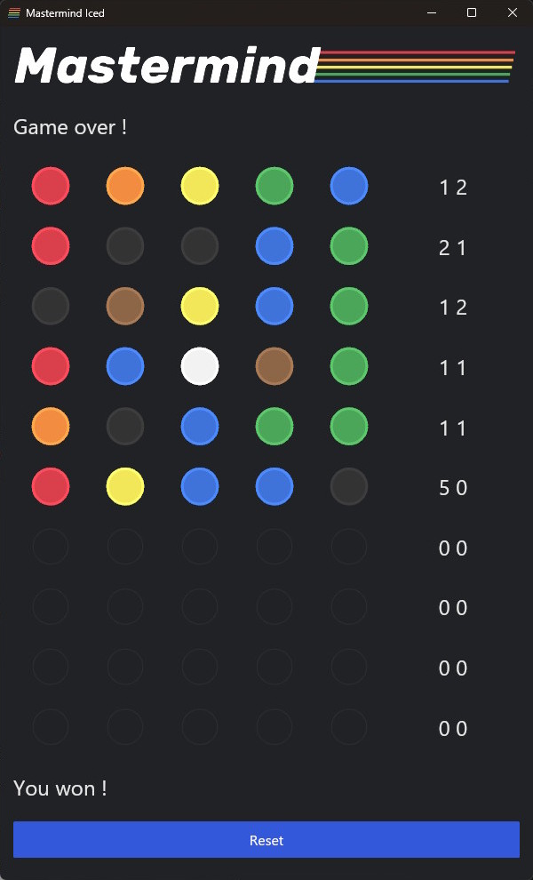

# 🎮 Mastermind in Rust

A clone of the classic **Mastermind** board game, built in [Rust](https://www.rust-lang.org/) with the [Iced](https://github.com/iced-rs/iced) GUI library.  
Two players game:
- **Code maker**: define the secret combination.
- **Code breaker**: try guesses and get feedback (right color & position / right color but wrong position).

---

## ✨ Features

- Graphical interface with **Iced**.
- **10 rows × 5 columns** guess grid.
- Intuitive color palette with 8 colors.
- Automatic feedback for each guess.
- Dark color theme.
- AI to solve the game (without cheating).

---

## 📸 Screenshots



---

## 🚀 Installation

### Prerequisites
- [Rust](https://www.rust-lang.org/tools/install) (latest stable recommended)
- Cargo (comes with Rust)

### Clone the repository
```bash
git clone https://github.com/your-username/mastermind-rust.git
cd mastermind-rust
```

### Build & run
```bash
cargo run
```

---

## 🛠️ Usage

Set the secret code in the bottom row and click Start.

Play a guess by setting the colors of the pawns row by row.

Click on a cell to cycle through colors or use the palette to select one.

Feedback is automatically displayed next to the row (see tooltip).

---

## 📦 Project Structure

`src/main.rs` → application entry point

`src/ui.rs` → Iced UI logic (containers, buttons, palette)

`src/game.rs` → game logic (rules, guess evaluation)

`assets/` → icons and graphic resources

---

## 🤝 Contributing

Contributions are welcome 🎉

1. Fork the project
2. Create a feature branch (git checkout -b feature/my-feature)
3. Commit your changes (git commit -m "Add my feature")
4. Push to the branch (git push origin feature/my-feature)
5. Open a Pull Request

---

## 📜 License

Distributed under the MIT License.
See LICENSE
 for more information.

---

## 💡 Acknowledgements

Inspired by the Mastermind board game (Invicta, 1970)

Built with Iced